# Image Inpainting

Implementaion of exemplar-based image inpainting algorithm by Criminisi et al. 

Requirements:

Python 2.7.9 or greater

Cython 0.22 or greater

NumPy for Python 2

SciPy for Python 2

Matplotlib for Python 2

#### Instructions

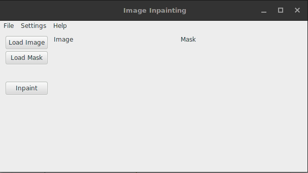

Run the program to open the GUI.

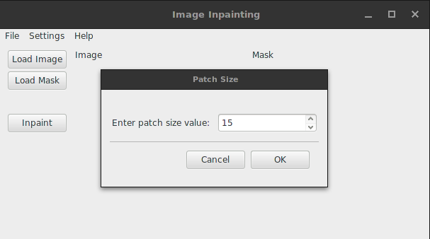

Enter the patch size. By default, it is 9. The patch size must be odd.

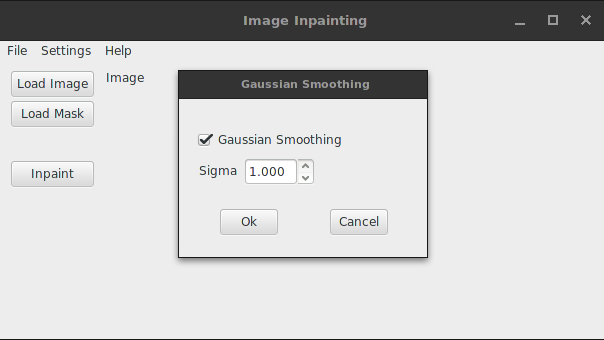

Choose to whether to apply Gaussian filtering prior to computing the image gradients and choose sigma value.

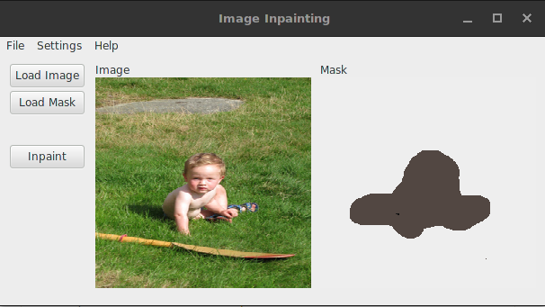

Load the image and its mask. Press the Inpaint button to run the algorithm.

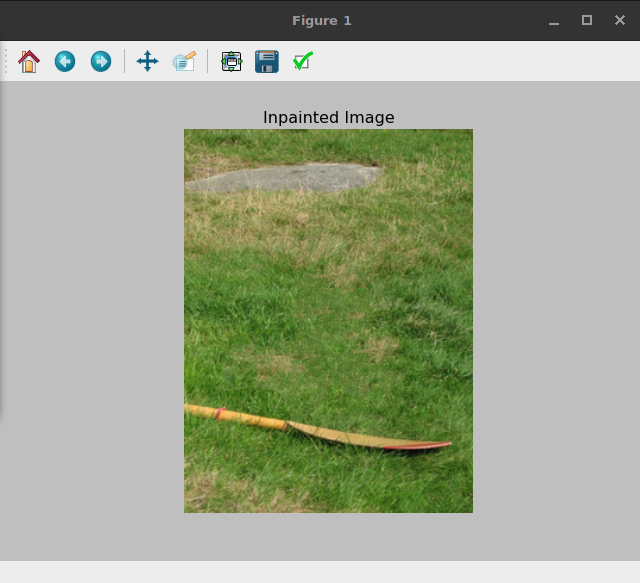

#### Some feasible results

##### Original image

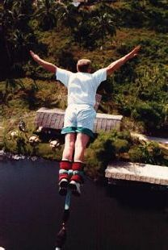

##### Mask

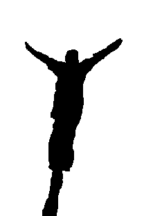

##### Inpainted images

Patch size 9, Gaussian smoothed with sigma=2

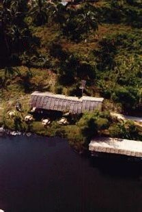

##### Original image

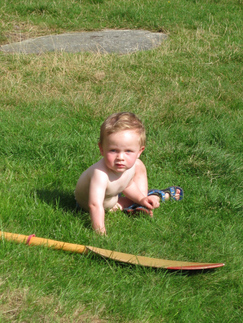

##### Mask

##### Inpainted image

Patch size 15, Gaussian smoothed with sigma=1

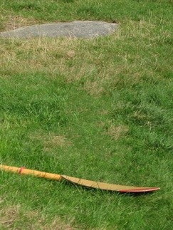

##### Original image

##### Mask

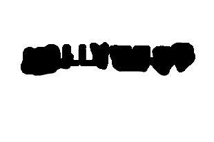

##### Inpainted image

Patch size 9, Gaussian smooth with sigma=1

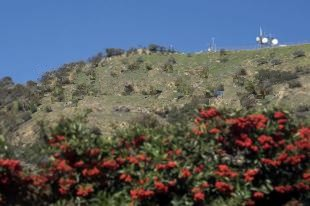

#### Not so good results

##### Original image

##### Mask

##### Inpainted images

Patch size 9, Gaussian smoothed with sigma=1.625

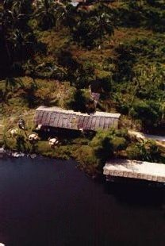

##### Original image

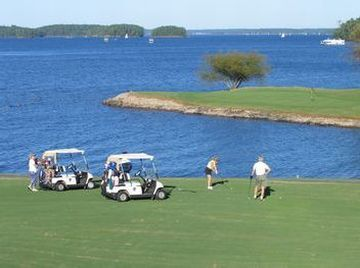

##### Mask

##### Inpainted image

Patch size 19, Gaussian smoothed with sigma=0.5

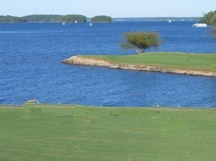

Patch size 37, no Gaussian smoothing

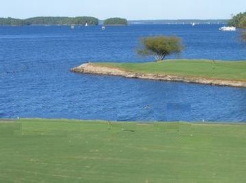

##### Original image

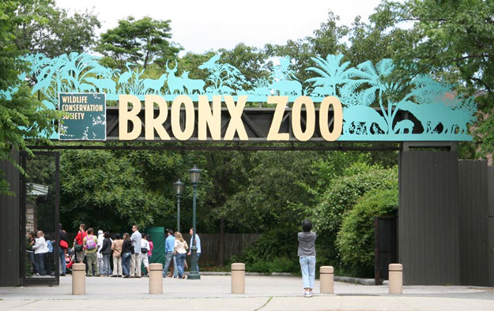

##### Mask

##### Inpainted image

Patch size 9, Gaussian smoothed with sigma=1.55

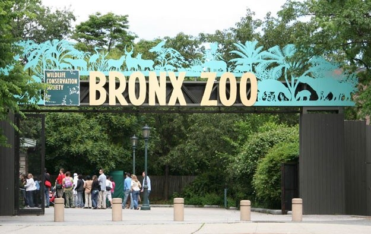

Patch size 9, Gaussian smoothed with sigma=1.625

